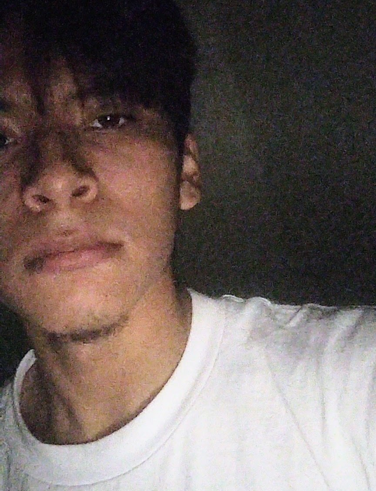

# Portfolio/Resume
<html lang = "en">
    <head>
        <meta charset="UTF-8">
        <title>Ozie's Sample Resume</title>
    </head>

    <body>
        
       <h1>Osvaldo Cruz -  Salinas</h1>
       
       

       <h2>Summary</h2>
       <ul>
        <li><h3>About Me:</h3></li>
            I am a passionate individual whose desire to learn becomes greater after passing day. 
        </ul>
        

        <h2>Education</h2>
        <ul>
            <li><h3>Long Beach Polytechnic High School Graduate</h3></li>
            

                (Aug 2018 - June 2021)
            

        </ul>
        

        <h2>Work Experience (March 2017 - Present)</h2>
        

            <li>Freelance Web Design</li>
            <li>Underwater Ceramic Technician</li>
            <li>Executive Marketing Promoter</li>
            <li>Asset Relocation Specialist</li>
        

        

        <h2>Skills</h2>
        <ul>
            <li>Leadership</li>
            <li>Communications</li>
            <li>Product Knowledge</li>
        </ul>
        

        <h2>Get in Touch with Me</h2>
        
        
        <footer>
            
© Osvaldo Cruz - Salinas (2023)

        </footer>
    </body>
</html>
